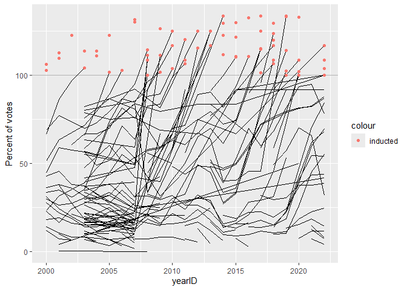

<!-- README.md is generated from README.Rmd. Please edit the README.Rmd file -->

# Lab report \#4 - instructions

Follow the instructions posted at
<https://ds202-at-isu.github.io/labs.html> for the lab assignment. The
work is meant to be finished during the lab time, but you have time
until Monday (after Thanksgiving) to polish things.

All submissions to the github repo will be automatically uploaded for
grading once the due date is passed. Submit a link to your repository on
Canvas (only one submission per team) to signal to the instructors that
you are done with your submission.

# Lab 4: Scraping (into) the Hall of Fame

<!-- -->

``` r
library(rvest)
```

    ## Warning: package 'rvest' was built under R version 4.4.3

    ## 
    ## Attaching package: 'rvest'

    ## The following object is masked from 'package:readr':
    ## 
    ##     guess_encoding

``` r
url <- "https://www.baseball-reference.com/awards/hof_2025.shtml"
html <- read_html(url)
html
```

    ## {html_document}
    ## <html data-version="klecko-" data-root="/home/br/build" lang="en" class="no-js">
    ## [1] <head>\n<meta http-equiv="Content-Type" content="text/html; charset=UTF-8 ...
    ## [2] <body class="br">\n<div id="wrap">\n  \n  <div id="header" role="banner"> ...

``` r
tables <- html %>% html_table(fill=TRUE)
tables
```

    ## [[1]]
    ## # A tibble: 29 × 39
    ##    ``    ``          ``    ``    ``    ``    ``    ``    ``    ``    ``    ``   
    ##    <chr> <chr>       <chr> <chr> <chr> <chr> <chr> <chr> <chr> <chr> <chr> <chr>
    ##  1 Rk    Name        YoB   Votes %vote HOFm  HOFs  Yrs   WAR   WAR7  JAWS  Jpos 
    ##  2 1     Ichiro Suz… 1st   393   99.7% 235   44    19    60.0  43.7  51.8  56.0 
    ##  3 2     CC Sabathia 1st   342   86.8% 128   48    19    62.3  39.4  50.8  61.3 
    ##  4 3     Billy Wagn… 10th  325   82.5% 107   24    16    27.7  19.8  23.7  31.6 
    ##  5 4     Carlos Bel… 3rd   277   70.3% 126   52    20    70.0  44.4  57.2  58.0 
    ##  6 5     Andruw Jon… 8th   261   66.2% 109   34    17    62.7  46.4  54.6  58.0 
    ##  7 6     Chase Utley 2nd   157   39.8% 94    36    16    64.6  49.3  57.0  56.9 
    ##  8 7     Alex Rodri… 4th   146   37.1% 390   77    22    117.4 64.3  90.8  55.4 
    ##  9 8     Manny Rami… 9th   135   34.3% 226   69    19    69.3  39.9  54.6  53.5 
    ## 10 9     Andy Petti… 7th   110   27.9% 128   44    18    60.2  34.1  47.2  61.3 
    ## # ℹ 19 more rows
    ## # ℹ 27 more variables: `Batting Stats` <chr>, `Batting Stats` <chr>,
    ## #   `Batting Stats` <chr>, `Batting Stats` <chr>, `Batting Stats` <chr>,
    ## #   `Batting Stats` <chr>, `Batting Stats` <chr>, `Batting Stats` <chr>,
    ## #   `Batting Stats` <chr>, `Batting Stats` <chr>, `Batting Stats` <chr>,
    ## #   `Batting Stats` <chr>, `Batting Stats` <chr>, `Pitching Stats` <chr>,
    ## #   `Pitching Stats` <chr>, `Pitching Stats` <chr>, `Pitching Stats` <chr>, …
    ## 
    ## [[2]]
    ## # A tibble: 3 × 40
    ##   ``    ``       ``    ``    ``    ``    ``    ``    ``    ``    `Batting Stats`
    ##   <chr> <chr>    <chr> <chr> <chr> <chr> <chr> <chr> <chr> <chr> <chr>          
    ## 1 Rk    Name     Indu… HOFm  HOFs  Yrs   WAR   WAR7  JAWS  Jpos  G              
    ## 2 1     Dick Al… as P… 99    39    15    58.7  45.8  52.3  56.1  1749           
    ## 3 2     Dave Pa… as P… 125   42    19    40.1  37.3  38.7  56.0  2466           
    ## # ℹ 29 more variables: `Batting Stats` <chr>, `Batting Stats` <chr>,
    ## #   `Batting Stats` <chr>, `Batting Stats` <chr>, `Batting Stats` <chr>,
    ## #   `Batting Stats` <chr>, `Batting Stats` <chr>, `Batting Stats` <chr>,
    ## #   `Batting Stats` <chr>, `Batting Stats` <chr>, `Batting Stats` <chr>,
    ## #   `Batting Stats` <chr>, `Pitching Stats` <chr>, `Pitching Stats` <chr>,
    ## #   `Pitching Stats` <chr>, `Pitching Stats` <chr>, `Pitching Stats` <chr>,
    ## #   `Pitching Stats` <chr>, `Pitching Stats` <chr>, `Pitching Stats` <chr>, …
